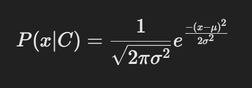

`__init__()`
- Initializes the classifier. It sets up dictionaries to store:

- Priors: The prior probabilities of each class.
- Likelihoods: The likelihood of each feature given a class (mean and variance for Gaussian).
- Classes: The different classes in the target variable.
- Feature stats: Holds the statistics (mean and variance) for each feature given a class.

`calculate_prior(y)`
- Calculates the prior probability P(C) for each class. This is done by counting the occurrences of each class in the target variable y and dividing by the total number of samples.

`calculate_likelihoods(X, y)`
This method calculates the likelihood P(X∣C) of the features given the class.

- For each class in the target y, it extracts the corresponding samples from X (features).
- For each feature, it calculates the mean and variance assuming the feature follows a normal distribution under that class. These statistics are stored in the feature_stats dictionary for later use.

`gaussian_likelihood(x, mean, var)`
- This method computes the likelihood for a feature value x, assuming that the feature follows a Gaussian distribution with the given mean and variance. This is based on the Gaussian probability density function:

`fit(X, y)`
- Trains the Naive Bayes classifier by:

- Calculating the prior probabilities for each class using calculate_prior().
- Calculating the mean and variance (for Gaussian likelihood) of each feature for each class using calculate_likelihoods().

`predict_single(x)`
- This method predicts the class label for a single instance x (a row of feature values).

- It computes the posterior probability for each class by summing the log of the priors and the likelihoods (using gaussian_likelihood()).
- Logarithms are used to avoid numerical underflow issues that arise when multiplying many small probabilities.
- It returns the class with the highest posterior probability.

`predict(X)`
- This method predicts the class labels for multiple instances by applying predict_single() to each row of the feature matrix X.