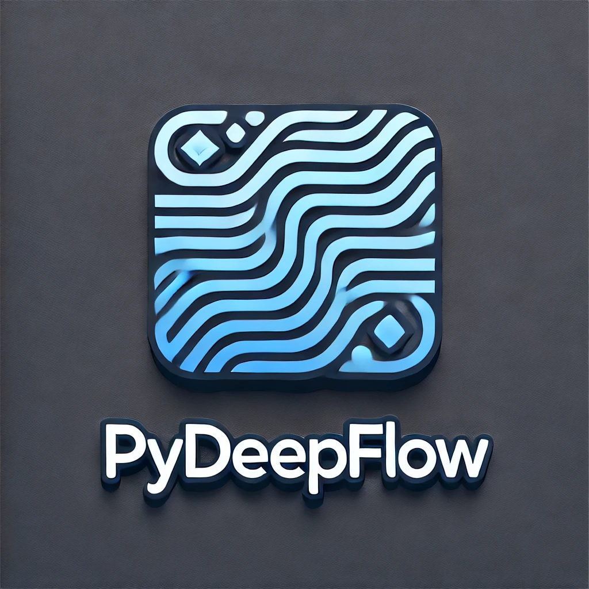

---

# **PyDeepFlow**

<p align="center">
  
</p>

## **Author**

**Author Name**: Ravin D  
**GitHub**: [ravin-d-27](https://github.com/ravin-d-27)  
**Email**: ravin.d3107@outlook.com
<br><br>
The author is passionate about deep learning and is dedicated to creating tools that make neural networks more accessible to everyone.

## Contributors

Thanks to these amazing people for contributing to this project:

<a href="https://github.com/ravin-d-27/PyDeepFlow/graphs/contributors">
  
</a>


## **What is Pydeepflow?**

`pydeepflow` is a Python library designed for building and training deep learning models with an emphasis on ease of use and flexibility. It abstracts many of the complexities found in traditional deep learning libraries while still offering powerful functionality. 

### **Key Features of Pydeepflow:**

- **Simplicity**: Designed for ease of use, making it accessible to beginners.
- **Configurability**: Users can easily modify network architectures, loss functions, and optimizers.
- **Flexibility**: Can seamlessly switch between CPU and GPU for training.

## **Why is Pydeepflow Better than TensorFlow and PyTorch?**

While TensorFlow and PyTorch are widely used and powerful frameworks, `pydeepflow` offers specific advantages for certain use cases:

1. **User-Friendly API**: `pydeepflow` is designed to be intuitive, allowing users to create and train neural networks without delving into complex configurations.
  
2. **Rapid Prototyping**: It enables quick testing of ideas with minimal boilerplate code, which is particularly beneficial for educational purposes and research.

3. **Lightweight**: The library has a smaller footprint compared to TensorFlow and PyTorch, making it faster to install and easier to use in lightweight environments.

4. **Focused Learning**: It provides a straightforward approach to understanding deep learning concepts without getting bogged down by the extensive features available in larger libraries.

## **Dependencies**

The project requires the following Python libraries:

- `numpy`: For numerical operations and handling arrays.
- `pandas`: For data manipulation and loading datasets.
- `scikit-learn`: For splitting data and preprocessing.
- `tqdm`: For progress bars in training.
- `jupyter`: (Optional) For working with Jupyter notebooks.
- `pydeepflow`: The core library used to implement the Multi-Layer ANN.

You can find the full list in `requirements.txt`.

## **How to Install and Use Pydeepflow from PyPI**

### **Installation**

You can install `pydeepflow` directly from PyPI using pip. Open your command line and run:

```bash
pip install pydeepflow
```

### **Using Pydeepflow**

After installing, you can start using `pydeepflow` to create and train neural networks. Below is a brief example:

```python
import pandas as pd
import numpy as np
from sklearn.model_selection import train_test_split
from sklearn.preprocessing import StandardScaler
from pydeepflow.model import Multi_Layer_ANN

# Load Iris dataset
url = "https://archive.ics.uci.edu/ml/machine-learning-databases/iris/iris.data"
df = pd.read_csv(url, header=None, names=["sepal_length", "sepal_width", "petal_length", "petal_width", "species"])

# Data preprocessing
df['species'] = df['species'].astype('category').cat.codes
X = df.iloc[:, :-1].values
y = np.eye(len(np.unique(y)))[y]

# Split data into training and testing sets
X_train, X_test, y_train, y_test = train_test_split(X, y, test_size=0.2, random_state=42)

# Standardization
scaler = StandardScaler()
X_train = scaler.fit_transform(X_train)
X_test = scaler.transform(X_test)

# Train ANN
ann = Multi_Layer_ANN(X_train, y_train, hidden_layers=[5, 5], activations=['relu', 'relu'], loss='categorical_crossentropy')
ann.fit(epochs=1000, learning_rate=0.01)

# Evaluate
y_pred = ann.predict(X_test)
accuracy = np.mean(np.argmax(y_pred, axis=1) == np.argmax(y_test, axis=1))
print(f"Test Accuracy: {accuracy * 100:.2f}%")
```

## **Contributing to Pydeepflow on GitHub**

Contributions are welcome! If you would like to contribute to `pydeepflow`, follow these steps:

1. **Fork the Repository**: Click the "Fork" button at the top right of the repository page.
  
2. **Clone Your Fork**: Use git to clone your forked repository:
   ```bash
   git clone https://github.com/ravin-d-27/PyDeepFlow.git
   cd pydeepflow
   ```

3. **Create a Branch**: Create a new branch for your feature or bug fix:
   ```bash
   git checkout -b my-feature-branch
   ```

4. **Make Your Changes**: Implement your changes and commit them:
   ```bash
   git commit -m "Add some feature"
   ```

5. **Push to Your Fork**:
   ```bash
   git push origin my-feature-branch
   ```

6. **Submit a Pull Request**: Go to the original repository and submit a pull request.

## **References**

- **Iris Dataset**: The dataset used in this project can be found at the UCI Machine Learning Repository: [Iris Dataset](https://archive.ics.uci.edu/ml/machine-learning-databases/iris/)
  
- **pydeepflow Documentation**: [pydeepflow Documentation](https://pypi.org/project/pydeepflow/)

- **Deep Learning Resources**: For more about deep learning, consider the following:
  - Goodfellow, Ian, et al. *Deep Learning*. MIT Press, 2016.
  - Chollet, François. *Deep Learning with Python*. Manning Publications, 2017.

---
